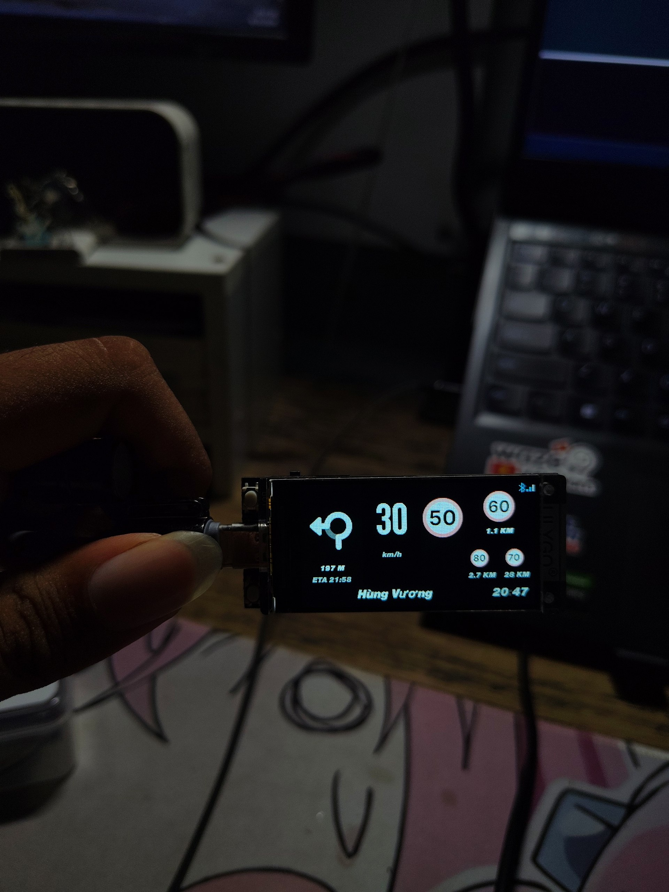
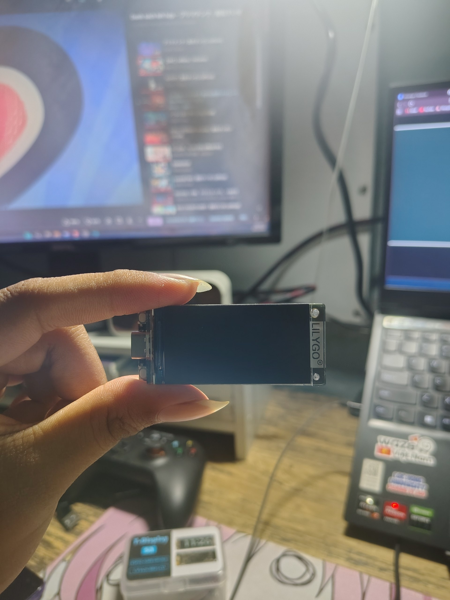
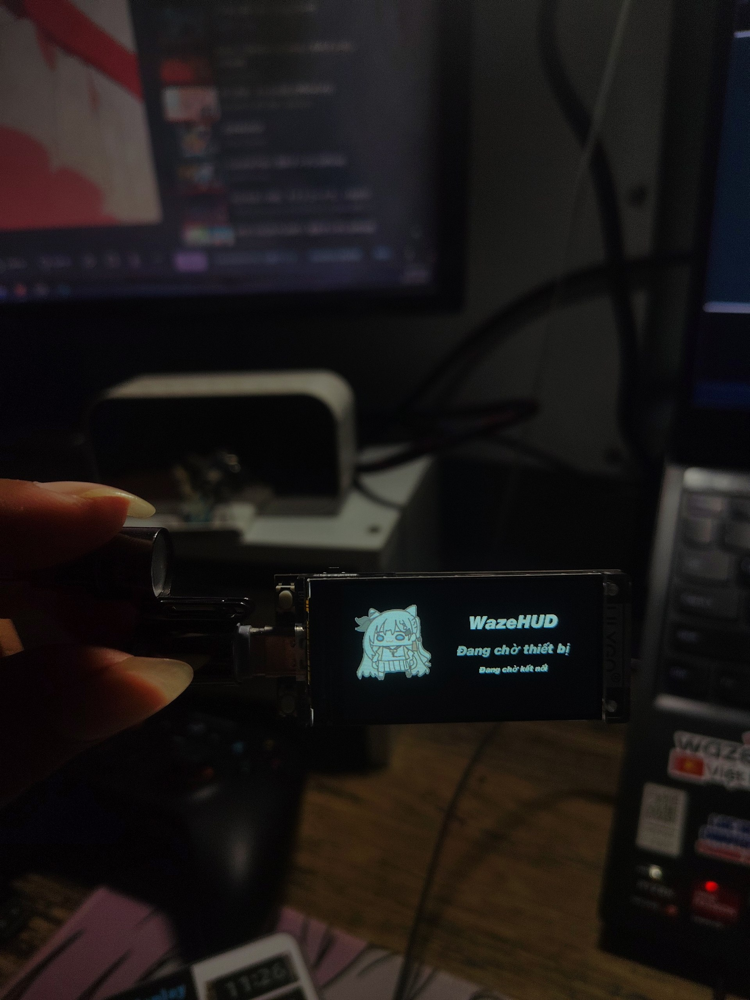
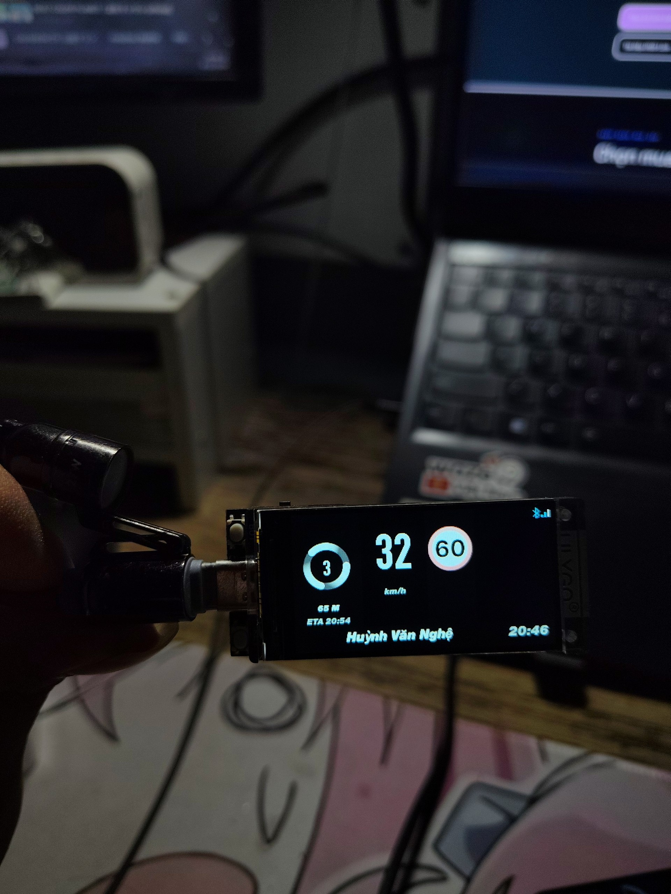
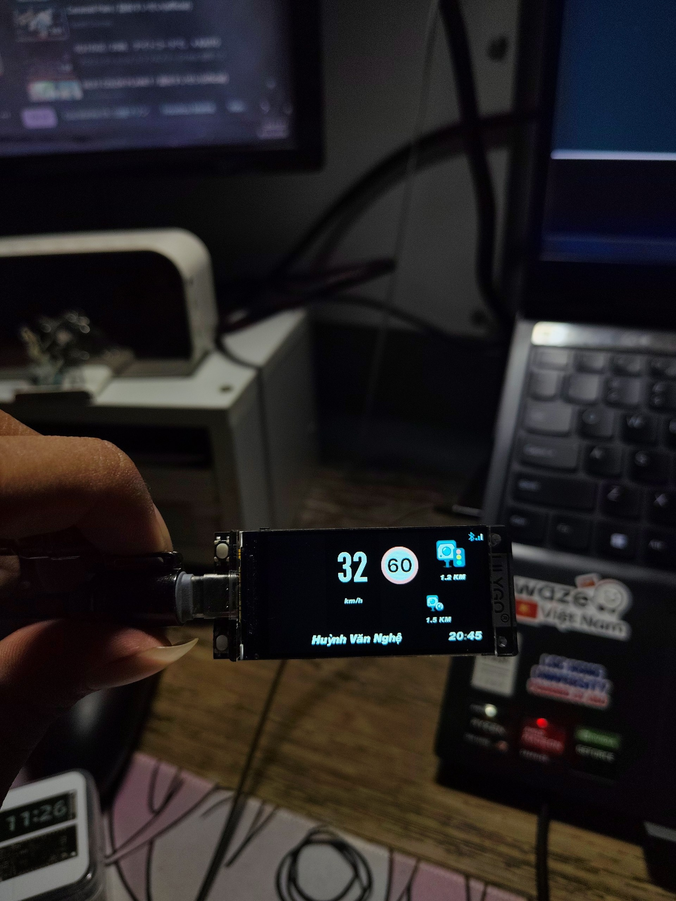
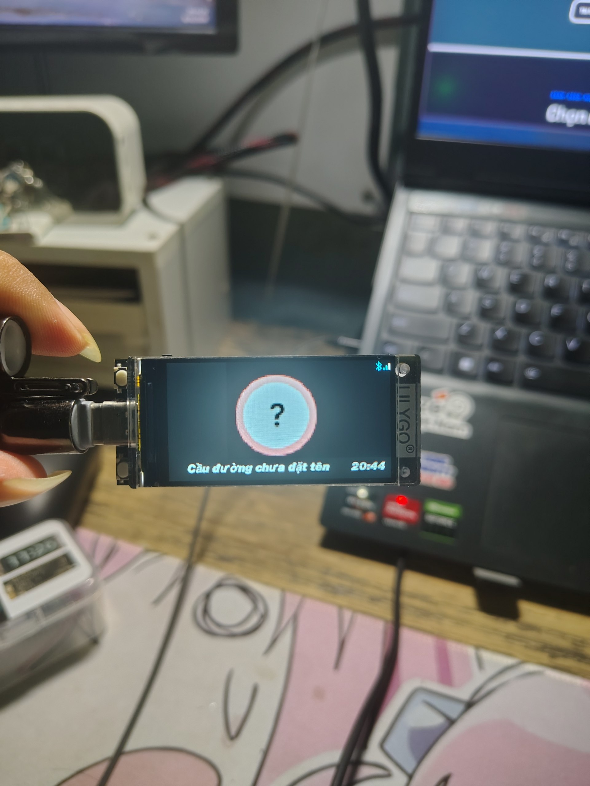
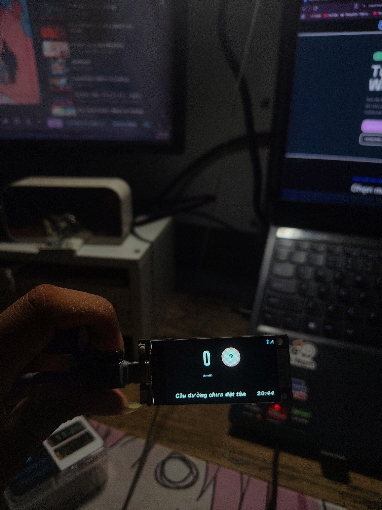

# WazeHUD cho LILYGO T-Display S3

Firmware ESP-IDF biến **LILYGO T-Display S3** thành màn hình HUD Bluetooth nhỏ gọn cho Waze/HLP/1. Thiết bị nhận dữ liệu dẫn đường qua BLE, ưu tiên thông tin có thể đọc nhanh: tốc độ, biển giới hạn, hướng rẽ, làn đường, cảnh báo và tên đường.

<p align="center">
  
</p>

> [!IMPORTANT]
> Đây là màn hình hỗ trợ thông tin, không thay thế cho việc quan sát biển báo, điều kiện giao thông hoặc các quyết định lái xe an toàn.

## Dành cho ai?

- Người dùng T-Display S3 muốn có HUD 320×170 kết nối với Waze mod hỗ trợ HLP/1.
- Người phát triển cần firmware ESP-IDF/NimBLE có kiến trúc tách riêng BLE, HLP, state và renderer.

<p align="center">
  
</p>

## Những gì HUD hiển thị

- Tốc độ hiện tại và cảnh báo vượt ngưỡng do firmware tự tính.
- Biển giới hạn tốc độ; khi bản đồ không có dữ liệu, HUD hiển thị biển `?` thay vì để trống.
- Hướng rẽ, khoảng cách, vòng xuyến và số lối ra; hỗ trợ lane guidance thực từ HLP/1.
- Cảnh báo phía trước: cảnh sát, camera, tai nạn, kẹt xe, cấm vượt, giảm tốc và các biển mở rộng.
- Tên đường Unicode tiếng Việt, ETA, đồng hồ đồng bộ từ producer, pin và RSSI Bluetooth.
- Chế độ chỉ giới hạn tốc độ lớn: ẩn tốc độ hiện tại nhưng vẫn giữ hướng rẽ, cảnh báo, tên đường, ETA/đồng hồ, pin và BLE.

| Màn chờ kết nối | Dẫn đường |
| --- | --- |
|  |  |

| Cảnh báo phía trước | Không có tuyến đang hoạt động |
| --- | --- |
|  |  |

| Biển giới hạn lớn | Không có giới hạn tốc độ từ bản đồ |
| --- | --- |
|  |  |

## Bắt đầu nhanh

### 1. Flash firmware

Nếu bạn đã có factory BIN, hãy làm theo [hướng dẫn flash tiếng Việt](FLASH_FIRMWARE_VI.md). Tài liệu này gồm cách vào download mode, phân biệt factory/OTA BIN và xử lý lỗi `Connecting...`.

Sau khi flash, điện thoại sẽ nhìn thấy thiết bị BLE tên **`WazeHUD`**.

### 2. Kết nối ứng dụng

1. Bật Bluetooth trên điện thoại.
2. Mở Waze mod/producer hỗ trợ giao thức HLP/1.
3. Kết nối tới `WazeHUD` và bật notifications cho characteristic RX.
4. Khi bắt đầu dẫn đường, HUD tự chuyển sang giao diện dẫn đường.

Firmware gửi `dev` sau khi notifications được bật, yêu cầu state tối đa 4 Hz và xử lý dữ liệu BLE phân mảnh an toàn.

### 3. Điều khiển trên board

| Thao tác | Kết quả |
| --- | --- |
| Bấm ngắn KEY | Xoay HUD 180° để đổi vị trí cổng USB. |
| Giữ KEY khoảng 1,2 giây | Hiện trạng thái pin và RSSI Bluetooth; thả nút để quay lại HUD. |

Phần trăm pin chỉ có ý nghĩa khi board chạy bằng pin. Khi USB-C đang cắm, mạch board không đọc được điện áp pin một cách đáng tin cậy.

## Cấu hình từ ứng dụng

Nếu producer quảng bá capability `device_config`, ứng dụng sẽ nhận schema cấu hình do HUD sở hữu. Cấu hình được lưu vào NVS và tự khôi phục sau khi khởi động lại.

| Mục | Tác dụng |
| --- | --- |
| Độ sáng | Điều chỉnh backlight từ 10–100%, bước 5%. |
| Giao diện | Chọn tự động, ban ngày hoặc ban đêm. |
| Kiểu hiển thị | `Tốc độ hiện tại` hoặc `Chỉ giới hạn tốc độ`. |
| Hiện tên đường | Bật/tắt thanh tên đường; tên dài tự chạy marquee. |
| Phản chiếu HUD | Lật ngang nội dung cho cách lắp HUD khác. |
| Xoay 180° | Đổi orientation để cổng USB nằm phía bên mong muốn. |
| Ngưỡng cảnh báo tốc độ | Offset từ -10 đến +5 km/h so với biển giới hạn. |
| Dịch ngang/dọc | Tinh chỉnh vị trí nội dung trong phạm vi ±5 px. |

Ở chế độ **Chỉ giới hạn tốc độ**, biển giới hạn lớn xuất hiện ở hai cột giữa. Hướng rẽ, cảnh báo, tên đường, ETA/đồng hồ, pin và Bluetooth vẫn được giữ lại.

## Tự build

Yêu cầu: ESP-IDF **5.5.5**, target `esp32s3` và cáp USB-C có dữ liệu.

Trong ESP-IDF PowerShell, chạy tại thư mục project:

```powershell
idf.py set-target esp32s3
idf.py build
idf.py -p COM9 flash
```

Thay `COM9` bằng cổng của board. Image ứng dụng được tạo tại `build/waze_hud_tdisplay_s3.bin`.

### Chạy mock UI không cần điện thoại

Mock mode tuần tự hiển thị các tình huống rẽ, cảnh báo, camera, cấm vượt, kẹt xe và tên đường dài để kiểm tra renderer.

```powershell
idf.py -B build-mock `
    -D SDKCONFIG=sdkconfig.mock `
    -D "SDKCONFIG_DEFAULTS=sdkconfig.defaults;sdkconfig.mock.defaults" `
    build
idf.py -B build-mock -p COM9 flash
```

Flash lại production bằng `idf.py -B build -p COM9 flash` khi hoàn tất kiểm tra mock.

## Kiến trúc

```text
Android / Waze mod
        │ BLE GATT
        ▼
NimBLE transport ──► HLP/1 framing + JSON decoder ──► HudState snapshot
                                                              │
                                                              ▼
                                                 Dirty-region HUD renderer
                                                              │
                                                              ▼
                                                     ST7789 LCD 320×170
```

- BLE callback chỉ sao chép chunk vào queue; không parse JSON hoặc vẽ LCD trong callback.
- Protocol task xử lý HLP line framing, UTF-8, ping/pong, handshake, reconnect và state ordering.
- Renderer chỉ nhận `HudState` đã chuẩn hóa; không biết JSON hay BLE.
- Assets và font được nhúng dạng RGB565/alpha mask, không decode PNG trong lúc render.

## Cấu trúc project

```text
main/
├── bluetooth/   # NimBLE GATT transport
├── protocol/    # HLP/1 framing, handshake và JSON decoder
├── state/       # HudState snapshot thread-safe
├── display/     # ST7789 driver, layout, font và renderer
├── config/      # Dynamic config + NVS
└── system/      # Battery/RSSI status
previews/        # Ảnh chụp HUD trên phần cứng
tools/           # Sinh asset nhúng từ assets nguồn
```

## Tài liệu liên quan

- [Hướng dẫn flash firmware](FLASH_FIRMWARE_VI.md)
- `dist/` — factory BIN, OTA BIN và checksum khi build/release cục bộ.
- `assets/` ở thư mục cha project — ảnh nguồn và font dùng để sinh asset nhúng.
